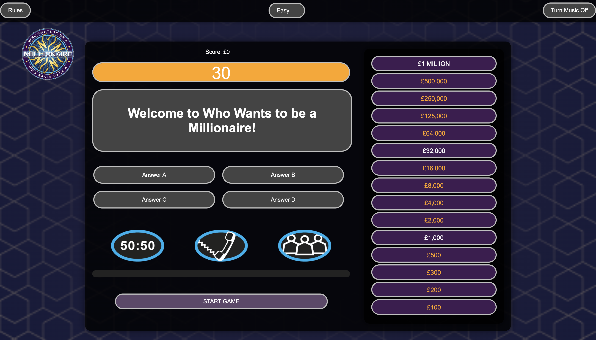
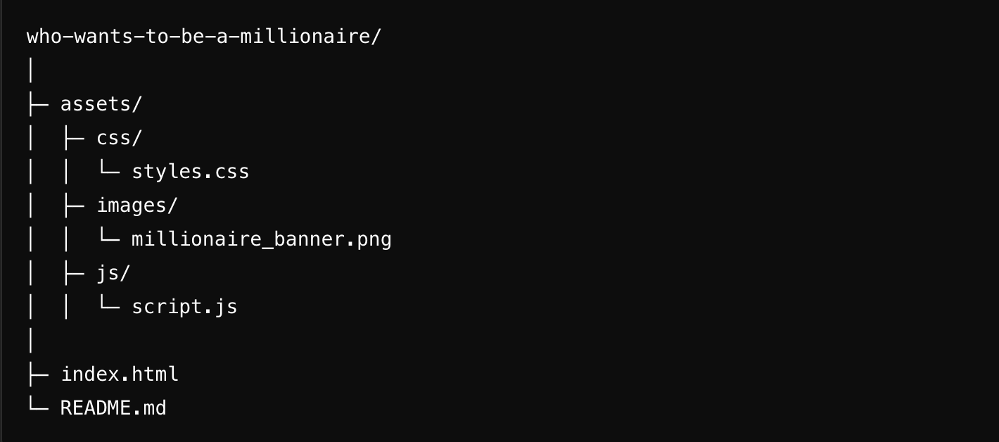

# Who Wants to Be a Millionaire



A fun and interactive trivia game inspired by the popular TV show **Who Wants to Be a Millionaire**. Test your knowledge, answer progressively challenging questions, and see if you can become a millionaire!

**Repository:** [https://github.com/wgwhitecoding/who-wants-to-be-a-millionaire](https://github.com/wgwhitecoding/who-wants-to-be-a-millionaire)

**Live Link** [Who Wants to Be a Millionaire Live](https://8000-wgwhitecodi-whowantstob-b41lt2v5gub.ws-eu117.gitpod.io/)


---

## Table of Contents
- [Overview](#overview)
- [Features](#features)
- [How to Play](#how-to-play)
- [Controls](#controls)
- [Game Mechanics](#game-mechanics)
- [Installation & Setup](#installation--setup)
- [Folder Structure](#folder-structure)
- [Technology Used](#technology-used)
- [Future Enhancements](#future-enhancements)
- [Contributing](#contributing)
- [Author](#author)
- [🤝 Connect with Me](#connect-with-me)

---

## Overview

The **Who Wants to Be a Millionaire** game challenges players with a series of multiple-choice questions that increase in difficulty. Correct answers bring players closer to becoming a millionaire, while wrong answers can lead to the loss of prize money. It's an engaging way to test your trivia skills!

---

## Features

- **Progressive Difficulty:** Questions get tougher as you advance to higher prize tiers.
- **Lifelines:** Use classic lifelines like "50:50," "Phone a Friend," and "Ask the Audience."
- **Leaderboard:** Track your performance and compare it with others.
- **Responsive Design:** Works seamlessly on desktop and mobile devices.

---

## How to Play

1. Start the game and answer the first question.
2. Progress through each level by selecting the correct answer.
3. Use lifelines strategically to help with challenging questions.
4. Win the top prize by correctly answering all the questions.

---

## Controls

**Desktop:**
- **Mouse Clicks:** Select answers or activate lifelines.

---

## Game Mechanics

- **Levels:** Progress through 15 levels of questions, each with increasing difficulty.
- **Lifelines:**  
  - **50:50:** Eliminates two incorrect answers.
  - **Phone a Friend:** Get a hint from a virtual "friend."
  - **Ask the Audience:** View audience polling results for help.
- **Scoring:** Correct answers increase your prize amount. Reaching specific levels secures a minimum guaranteed prize.

---

## Installation & Setup

1. **Clone the Repository:**
   ```bash
   git clone https://github.com/wgwhitecoding/who-wants-to-be-a-millionaire.git

2. **Navigate to the Project Directory:**

    ```bash
    cd who-wants-to-be-a-millionaire

3. **Open the Game:**

- Open the index.html file in your favorite web browser. No additional setup or dependencies required.

## Folder Structure



## Technology Used

### Frontend Technologies

- [](https://developer.mozilla.org/en-US/docs/Web/HTML)  
  **HTML5:** Used to structure the game interface and question layout.

- [](https://developer.mozilla.org/en-US/docs/Web/CSS)  
  **CSS3:** Provides styling and responsive design for the game.

- [](https://developer.mozilla.org/en-US/docs/Web/JavaScript)  
  **JavaScript:** Implements game logic, user interactions, and lifeline mechanics.


---

## Future Enhancements

- **Additional Questions:** Expand the question database to include more topics and difficulty levels.
- **Custom Lifelines:** Introduce new lifelines for advanced gameplay.
- **Multiplayer Mode:** Add a competitive mode where players can challenge each other.
- **Localization:** Support multiple languages to reach a global audience.

---

## Contributing

Contributions are welcome! To get involved:

1. **Fork** the repository.
2. **Create a new branch** for your feature or bugfix.
3. **Make your changes** and test thoroughly.
4. **Submit a pull request** describing your modifications.

We encourage contributions that improve gameplay, visuals, or overall user experience.

---

## Author

Created and maintained by **[Walid White](https://github.com/wgwhitecoding)**. Passionate about web development and creating engaging user experiences.

---

## 🤝 Connect with Me <a id="connect-with-me"></a>


<div align="center">
 <p>✨ Feel free to reach out for collaborations, projects, or just a chat! ✨</p>
 
  
  <a href="https://www.linkedin.com/in/walidwillwhite/" target="_blank">
    
  </a>
  <a href="mailto:walidwillwhite@gmail.com" target="_blank">
    
  </a>
  <a href="https://wgwhitecoding.github.io/portfolio/" target="_blank">
    
  </a>
  <a href="https://wgwhitecoding.github.io/CoolSites/" target="_blank">
    
  </a>
  <a href="https://www.linkedin.com/company/techa-nalogy/?viewAsMember=true" target="_blank">
    
  </a>
</div>
<br><br>
<div align="center">
🚀 Let’s connect and build something amazing together! 🚀
</div>


